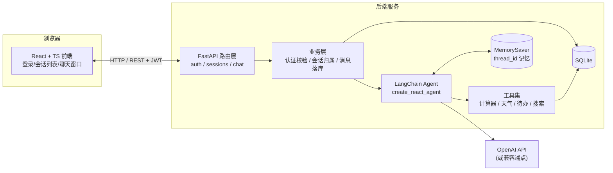
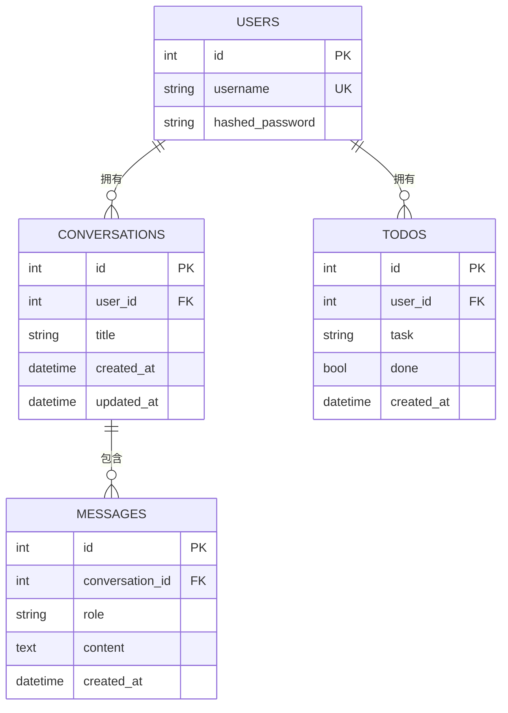
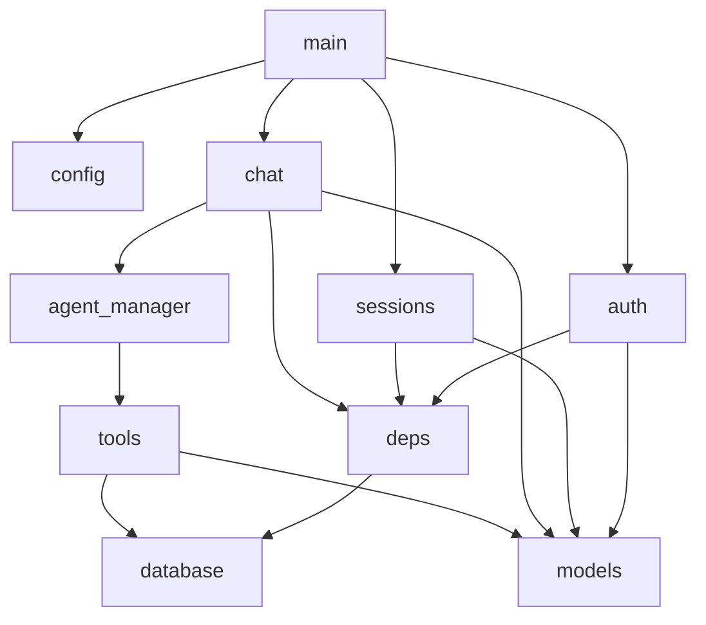
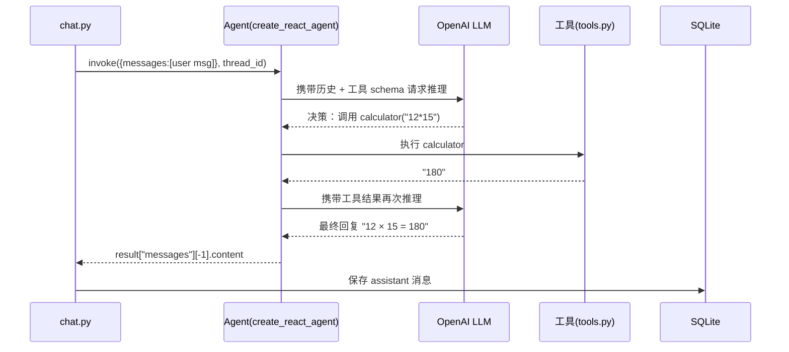
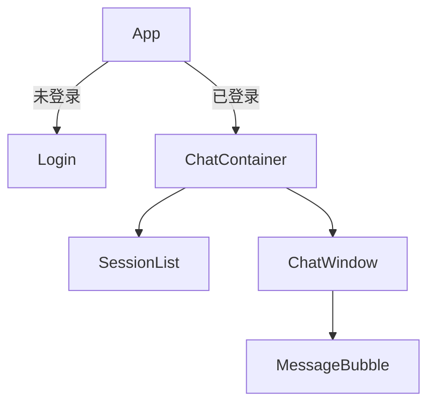
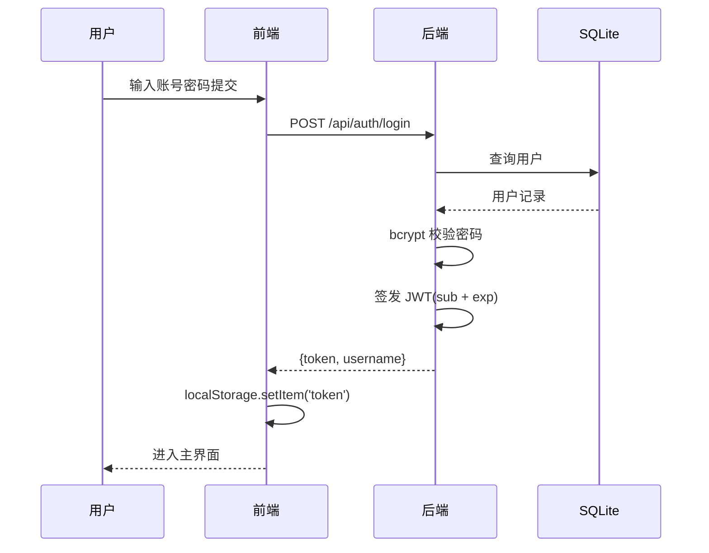

# 智能个人助理系统 · 详细开发规格说明书

> 本文档是对《智能个人助理系统开发文档》的**工程化细化版本**，可直接照着动手实现。
> 相对原文档的核心升级：**LangChain 旧版 `initialize_agent` 已废弃**，本文统一采用新版
> `langgraph.prebuilt.create_react_agent` 写法；同时修复了原文档中的三处隐患
> （`eval` 不安全、待办无多用户隔离、天气 Key 硬编码）。

---

## 0. 文档导读

| 章节 | 内容 | 适合阶段 |
|------|------|----------|
| §1–§3 | 目标、技术栈、架构 | 立项与选型 |
| §4 | 目录结构 | 初始化工程 |
| §5 | 数据库设计（含 ER 图） | 阶段 1 |
| §6 | 接口规范（API Reference） | 阶段 2–5 的对照标准 |
| §7–§8 | 后端实现规格 + Agent 详解 | 阶段 2–5 |
| §9 | 前端实现规格 | 阶段 6 |
| §10 | 核心交互时序 | 联调 |
| §11 | 环境安装与运行 | 阶段 0 |
| §12 | 分阶段实施计划 | 全程 |
| §13 | 测试方案 | 阶段 7 |
| §14 | 排障 | 随时 |
| §15–§16 | 扩展路线、附录（依赖清单） | 结题/加分项 |

---

## 1. 项目概述

### 1.1 目标与范围

开发一个**多用户、多会话**的智能个人助理 Web 应用：用户在浏览器登录后，可与 AI 助手
进行多轮对话；助手具备**工具调用能力**（计算器、天气查询、待办管理、网页搜索）与
**会话级记忆**；所有数据持久化到 SQLite。

### 1.2 核心功能清单（按优先级）

| 优先级 | 功能 | 说明 | 验收标准 |
|--------|------|------|----------|
| P0 | 用户注册/登录 | JWT 认证 | 能注册、登录、错误密码被拒 |
| P0 | 多轮对话 | 上下文记忆 | 追问代词（"那再来一遍"）能理解 |
| P0 | 会话管理 | 新建/切换/删除 | 会话间上下文互不污染 |
| P0 | 消息持久化 | 刷新后历史仍在 | 刷新页面历史不丢 |
| P1 | 计算器工具 | 安全四则运算 | 输入 `12*15` 返回 180 |
| P1 | 天气工具 | OpenWeatherMap | 输入城市返回温度/天气 |
| P1 | 待办工具 | 增/查，按用户隔离 | A 用户看不到 B 用户的待办 |
| P2 | 网页搜索 | DuckDuckGo | 返回前 3 条摘要 |
| P2 | 会话自动标题 | 首条消息截取 | 会话列表显示有意义标题 |

### 1.3 非功能性需求

- **安全**：密码 bcrypt 哈希、JWT 过期校验、SQLAlchemy 参数化查询防注入、计算器禁止 `eval`。
- **多用户隔离**：会话、消息、待办均以 `user_id` 归属校验，杜绝越权访问。
- **可维护性**：后端分层（路由/业务/数据）、前端组件化、类型定义集中。
- **可扩展性**：预留 RAG、流式响应、记忆持久化接口（见 §15）。

---

## 2. 技术选型与版本锁定

### 2.1 后端

| 组件 | 用途 | 最低版本 |
|------|------|----------|
| Python | 运行时 | 3.10+ |
| FastAPI | Web 框架 | ≥0.115 |
| Uvicorn | ASGI 服务器 | ≥0.30 |
| SQLAlchemy | ORM | ≥2.0 |
| Pydantic | 数据校验 | ≥2.7 |
| PyJWT | JWT 签发/校验 | ≥2.8 |
| passlib[bcrypt] | 密码哈希 | ≥1.7.4 |
| python-dotenv | 环境变量 | ≥1.0 |
| requests | HTTP 客户端（天气） | ≥2.31 |
| duckduckgo-search | 网页搜索 | ≥6.0 |
| langchain | Agent 框架 | ≥0.3 |
| langchain-openai | OpenAI 接入 | ≥0.2 |
| langgraph | Agent 编排 + 记忆 | ≥0.2 |

### 2.2 前端

| 组件 | 用途 | 最低版本 |
|------|------|----------|
| React | UI 框架 | ^18.3 |
| TypeScript | 类型安全 | ^5.5 |
| Vite | 构建/开发服务器 | ^5.4 |
| axios | HTTP 客户端 | ^1.7 |
| react-markdown | Markdown 渲染 | ^9.0 |

### 2.3 关键选型说明

1. **为什么不用旧版 `initialize_agent`**：`initialize_agent`、`AgentType.CHAT_CONVERSATIONAL_REACT_DESCRIPTION`、
   `ConversationBufferWindowMemory` 均已在 LangChain 0.2 起标记废弃，0.3 起不推荐。
   新版统一走 `langgraph.prebuilt.create_react_agent`，工具调用更稳定、记忆更清晰。
2. **为什么待办表要加 `user_id`**：原文档 `TodoItem` 无归属字段，多用户场景下所有人共享一份待办，
   属于明显缺陷。本文将其纳入会话归属校验体系。
3. **为什么用 PyJWT 而非 python-jose**：python-jose 维护停滞、存在已知 CVE，PyJWT 更活跃、API 更简洁。
4. **计算器为什么弃用 `eval`**：`eval` 可执行任意代码，属高危漏洞。改用 `ast` 白名单解析（见 §7.6）。

---

## 3. 系统架构

### 3.1 总体架构



### 3.2 后端分层职责

| 层 | 文件 | 职责 | 不做什么 |
|----|------|------|----------|
| 入口层 | `main.py` | 装配 app、注册路由、CORS、启动初始化 | 不写业务 |
| 路由层 | `auth.py` / `sessions.py` / `chat.py` | 参数接收、HTTP 状态、返回模型 | 不直接写 SQL |
| 依赖层 | `deps.py` | JWT 解析、当前用户注入 | — |
| 数据层 | `database.py` / `models.py` | 连接、ORM 模型、建表 | 不写业务规则 |
| 校验层 | `schemas.py` | 请求/响应 Pydantic 模型 | — |
| Agent 层 | `agent_manager.py` / `tools.py` | Agent 构建、工具定义 | 不接触 HTTP |

### 3.3 一次请求的数据流

```
用户输入 → 前端 axios(/api/chat) → FastAPI 路由 → JWT 校验(user_id)
        → 校验会话归属 → 保存 user 消息 → agent.invoke(thread_id)
        → LLM 决定是否调工具 → 工具执行(可读写 DB) → 生成最终回复
        → 保存 assistant 消息 → 返回 {reply} → 前端渲染
```

---

## 4. 项目目录结构

```
smart-assistant/
├── backend/
│   ├── app/
│   │   ├── __init__.py
│   │   ├── main.py            # FastAPI 入口 + CORS + 路由注册 + 日程提醒协程启动
│   │   ├── config.py          # 环境变量集中配置（含 SYSTEM_PROMPT）
│   │   ├── database.py        # engine / SessionLocal / Base / get_db / init_db
│   │   ├── models.py          # User/Conversation/Message/TodoItem/Note/Schedule/
│   │   │                      #   Course/Skill/FileItem/KbCollection/KbChunk/Notification
│   │   ├── schemas.py         # Pydantic 请求与响应模型
│   │   ├── deps.py            # get_current_user 依赖
│   │   ├── auth.py            # 注册 / 登录
│   │   ├── sessions.py        # 会话 CRUD + 单条消息删除 / 批量清空
│   │   ├── chat.py            # 聊天路由（SSE 流式，核心）
│   │   ├── agent_manager.py   # Agent 工厂 + 缓存（云端直连 http_client）
│   │   ├── tools.py           # 给模型调用的工具（计算器/天气/搜索/待办/通知/知识库）
│   │   ├── rag.py             # 向量化 + 检索
│   │   ├── files.py           # 附件上传 / 解析
│   │   ├── kb.py              # 知识库（集合 + 文档 + 图谱）
│   │   ├── search.py          # 历史消息搜索
│   │   ├── notifications.py   # 站内通知（铃铛）
│   │   ├── users.py           # 个人资料
│   │   ├── api_keys.py        # API Key 展示
│   │   ├── llm_config.py      # 云端模型配置
│   │   ├── skills.py          # 技能 CRUD
│   │   ├── todos.py           # 待办 CRUD
│   │   ├── weather.py         # 天气查询
│   │   ├── notes.py           # 智能笔记（按日期 + AI 归纳）    ← 新增
│   │   ├── schedules.py       # 日程 + 提前 5 分钟提醒          ← 新增
│   │   └── courses.py         # 课表                            ← 新增
│   ├── requirements.txt
│   ├── .env.example
│   └── .env                   # 本地敏感配置（不入库）
├── frontend/
│   ├── index.html
│   ├── vite.config.ts         # /api 代理到 8000
│   ├── tsconfig.json
│   ├── package.json
│   └── src/
│       ├── main.tsx
│       ├── App.tsx            # 登录态路由
│       ├── i18n.tsx           # 文案
│       ├── types.ts           # 类型定义
│       ├── styles.css
│       ├── api/
│       │   ├── client.ts      # axios 实例 + 拦截器
│       │   └── index.ts       # API 函数封装
│       ├── components/
│       │   ├── Login.tsx
│       │   ├── MainLayout.tsx     # 三栏布局 + 路由分发 + 设置/云端弹窗
│       │   ├── SessionList.tsx    # 左侧会话列表（左下角含设置入口）
│       │   ├── ChatWindow.tsx     # 聊天主窗（流式/停止/导出）
│       │   ├── MessageBubble.tsx  # 气泡 + Mermaid 图表渲染
│       │   ├── FunctionPanel.tsx  # 右侧功能入口（可拖拽排序）
│       │   ├── PageShell.tsx      # 功能页统一外壳（标题 + 返回对话）
│       │   ├── SettingsModal.tsx / CloudConnectModal.tsx
│       │   ├── NotificationBell.tsx / Tooltip.tsx / DocViewer.tsx
│       │   ├── SkillCards.tsx / SkillsPanel.tsx / KbPicker.tsx / KbGraph.tsx
│       │   └── ModelPicker.tsx / TodoTool.tsx / Weather.tsx
│       └── pages/
│           ├── WeatherPage / SkillsPage / TodosPage / TimerPage
│           ├── CalendarPage / KnowledgePage
│           ├── NotesPage.tsx      # 智能笔记          ← 新增
│           ├── SchedulePage.tsx   # 日程规划          ← 新增
│           └── TimetablePage.tsx  # 课表              ← 新增
├── README.md
└── docs/
    └── 开发文档_详细版.md     # 本文档
```

---

## 5. 数据库设计

### 5.1 ER 图



### 5.2 表结构详细定义

#### users
| 字段 | 类型 | 约束 | 说明 |
|------|------|------|------|
| id | Integer | PK, autoincrement | 用户 ID |
| username | String(50) | unique, not null, index | 登录名 |
| hashed_password | String(255) | not null | bcrypt 哈希，**绝不存明文** |

#### conversations
| 字段 | 类型 | 约束 | 说明 |
|------|------|------|------|
| id | Integer | PK | 会话 ID |
| user_id | Integer | FK→users.id, not null, index | 归属用户 |
| title | String(100) | default "新对话" | 会话标题 |
| created_at | DateTime | default now | 创建时间 |
| updated_at | DateTime | default now, index | 最近活跃时间（列表排序用） |

#### messages
| 字段 | 类型 | 约束 | 说明 |
|------|------|------|------|
| id | Integer | PK | 消息 ID |
| conversation_id | Integer | FK→conversations.id, not null, index | 所属会话 |
| role | String(20) | not null | `user` 或 `assistant` |
| content | Text | not null | 消息正文 |
| created_at | DateTime | default now | 时间戳（历史排序用） |

#### todos
| 字段 | 类型 | 约束 | 说明 |
|------|------|------|------|
| id | Integer | PK | 待办 ID |
| user_id | Integer | FK→users.id, not null, index | 归属用户（隔离关键） |
| task | String(500) | not null | 待办内容 |
| done | Boolean | default false | 是否完成 |
| created_at | DateTime | default now | 创建时间 |

### 5.3 关系与隔离规则

- `conversations.user_id` 与 `todos.user_id` 是**多用户隔离的根**。
- 任何会话/消息/待办查询，**必须**先通过 `WHERE user_id = 当前用户` 校验，否则返回 404/403。

### 5.4 建表方式

开发期在应用启动时自动建表（`Base.metadata.create_all`），生产环境建议引入 Alembic 迁移（见 §15）。

---

## 6. 接口规范（API Reference）

### 6.1 通用约定

- **Base URL**：`http://localhost:8000/api`
- **认证**：除 `register`/`login` 外，请求头携带 `Authorization: Bearer <token>`。
- **内容类型**：`application/json`。
- **错误响应统一格式**：
  ```json
  { "detail": "错误描述" }
  ```

### 6.2 接口详表

#### ① 用户注册
- `POST /api/auth/register`

| 项 | 内容 |
|----|------|
| 请求体 | `{ "username": "alice", "password": "123456" }` |
| 成功响应 | `200 { "token": "...", "token_type": "bearer", "username": "alice" }` |
| 失败 | `400 { "detail": "用户名已存在" }` |

#### ② 用户登录
- `POST /api/auth/login`

| 项 | 内容 |
|----|------|
| 请求体 | `{ "username": "alice", "password": "123456" }` |
| 成功响应 | `200 { "token": "...", "token_type": "bearer", "username": "alice" }` |
| 失败 | `401 { "detail": "用户名或密码错误" }` |

#### ③ 获取会话列表
- `GET /api/sessions`
- 响应：按 `updated_at` 倒序返回

```json
[
  { "id": 1, "title": "帮我算一道题", "created_at": "...", "updated_at": "..." },
  { "id": 2, "title": "新对话", "created_at": "...", "updated_at": "..." }
]
```

#### ④ 新建会话
- `POST /api/sessions`
- 请求体 `{ "title": "可选标题" }`，缺省为 `"新对话"`
- 响应 `200 { "id": 3 }`（含 title 等完整对象亦可）

#### ⑤ 获取会话消息历史
- `GET /api/sessions/{session_id}/messages`
- 响应：按 `created_at` 正序

```json
[
  { "role": "user", "content": "帮我计算 12*15", "created_at": "..." },
  { "role": "assistant", "content": "180", "created_at": "..." }
]
```

#### ⑥ 发送消息
- `POST /api/chat`
- 请求体 `{ "session_id": 1, "message": "帮我计算 12*15" }`
- 响应 `200 { "reply": "12 × 15 = 180" }`
- 失败：`400` 缺参数、`404` 会话不存在或不属于当前用户、`500` Agent 执行异常（降级返回错误文本）

#### ⑦ 删除会话
- `DELETE /api/sessions/{session_id}`
- 响应 `200 { "status": "deleted" }`
- 说明：级联删除该会话下所有消息（Agent 缓存中的记忆需同步清理，见 §7.8）。

### 6.3 状态码约定

| 状态码 | 场景 |
|--------|------|
| 200 | 成功 |
| 400 | 参数缺失/用户名已存在 |
| 401 | 未登录 / token 过期 / 密码错误 |
| 404 | 资源不存在或**不属于当前用户**（防越权） |
| 500 | 服务端异常 |

---

## 7. 后端实现规格

### 7.1 文件职责与依赖关系



### 7.2 config.py —— 集中配置

```python
import os
from dotenv import load_dotenv

load_dotenv()

OPENAI_API_KEY = os.getenv("OPENAI_API_KEY", "")
OPENAI_MODEL = os.getenv("OPENAI_MODEL", "gpt-4o-mini")
OPENWEATHERMAP_API_KEY = os.getenv("OPENWEATHERMAP_API_KEY", "")
SECRET_KEY = os.getenv("SECRET_KEY", "dev-secret-change-me")
ALGORITHM = "HS256"
ACCESS_TOKEN_EXPIRE_MINUTES = int(os.getenv("ACCESS_TOKEN_EXPIRE_MINUTES", "1440"))
DATABASE_URL = os.getenv("DATABASE_URL", "sqlite:///./app.db")
```

> 注意：`SECRET_KEY` 在生产环境必须更换为强随机值，禁止使用默认值。

### 7.3 database.py —— 连接与会话

```python
from sqlalchemy import create_engine
from sqlalchemy.orm import sessionmaker, declarative_base
from config import DATABASE_URL

engine = create_engine(
    DATABASE_URL,
    connect_args={"check_same_thread": False} if DATABASE_URL.startswith("sqlite") else {},
)
SessionLocal = sessionmaker(autocommit=False, autoflush=False, bind=engine)
Base = declarative_base()

def get_db():
    db = SessionLocal()
    try:
        yield db
    finally:
        db.close()

def init_db():
    from models import Base as _  # 确保模型已注册
    Base.metadata.create_all(bind=engine)
```

### 7.4 models.py —— ORM 模型

```python
from datetime import datetime, timezone
from sqlalchemy import Column, Integer, String, Text, Boolean, DateTime, ForeignKey
from database import Base

def utcnow():
    return datetime.now(timezone.utc)

class User(Base):
    __tablename__ = "users"
    id = Column(Integer, primary_key=True, index=True)
    username = Column(String(50), unique=True, index=True, nullable=False)
    hashed_password = Column(String(255), nullable=False)

class Conversation(Base):
    __tablename__ = "conversations"
    id = Column(Integer, primary_key=True, index=True)
    user_id = Column(Integer, ForeignKey("users.id"), nullable=False, index=True)
    title = Column(String(100), default="新对话")
    created_at = Column(DateTime, default=utcnow)
    updated_at = Column(DateTime, default=utcnow, index=True)

class Message(Base):
    __tablename__ = "messages"
    id = Column(Integer, primary_key=True, index=True)
    conversation_id = Column(Integer, ForeignKey("conversations.id"), nullable=False, index=True)
    role = Column(String(20), nullable=False)
    content = Column(Text, nullable=False)
    created_at = Column(DateTime, default=utcnow)

class TodoItem(Base):
    __tablename__ = "todos"
    id = Column(Integer, primary_key=True, index=True)
    user_id = Column(Integer, ForeignKey("users.id"), nullable=False, index=True)
    task = Column(String(500), nullable=False)
    done = Column(Boolean, default=False)
    created_at = Column(DateTime, default=utcnow)
```

> 说明：`datetime.utcnow()` 在 Python 3.12+ 已废弃，统一改用 `datetime.now(timezone.utc)`。

### 7.5 schemas.py —— Pydantic 模型

```python
from datetime import datetime
from pydantic import BaseModel, ConfigDict

class RegisterRequest(BaseModel):
    username: str
    password: str

class LoginRequest(BaseModel):
    username: str
    password: str

class TokenResponse(BaseModel):
    token: str
    token_type: str = "bearer"
    username: str

class SessionCreate(BaseModel):
    title: str | None = "新对话"

class SessionOut(BaseModel):
    model_config = ConfigDict(from_attributes=True)
    id: int
    title: str
    created_at: datetime
    updated_at: datetime

class MessageOut(BaseModel):
    model_config = ConfigDict(from_attributes=True)
    role: str
    content: str
    created_at: datetime

class ChatRequest(BaseModel):
    session_id: int
    message: str

class ChatResponse(BaseModel):
    reply: str
```

### 7.6 tools.py —— 工具定义（新版 + 安全加固）

```python
import ast
import operator
import os
import requests
from langchain_core.tools import tool
from database import SessionLocal
from models import TodoItem

# ---------- 安全计算器（AST 白名单，替代 eval） ----------
_ALLOWED_BINOPS = {
    ast.Add: operator.add, ast.Sub: operator.sub, ast.Mult: operator.mul,
    ast.Div: operator.truediv, ast.Pow: operator.pow, ast.Mod: operator.mod,
}
_ALLOWED_UNARY = {ast.USub: operator.neg, ast.UAdd: operator.pos}

def _safe_eval(node):
    if isinstance(node, ast.Expression):
        return _safe_eval(node.body)
    if isinstance(node, ast.Constant) and isinstance(node.value, (int, float)):
        return node.value
    if isinstance(node, ast.BinOp) and type(node.op) in _ALLOWED_BINOPS:
        return _ALLOWED_BINOPS[type(node.op)](_safe_eval(node.left), _safe_eval(node.right))
    if isinstance(node, ast.UnaryOp) and type(node.op) in _ALLOWED_UNARY:
        return _ALLOWED_UNARY[type(node.op)](_safe_eval(node.operand))
    raise ValueError("不支持的表达式")

@tool
def calculator(expression: str) -> str:
    """计算四则运算数学表达式。输入为算术表达式字符串，例如 '2+3*4'，返回计算结果。"""
    try:
        return str(_safe_eval(ast.parse(expression, mode="eval")))
    except Exception as e:
        return f"计算错误: {e}"

# ---------- 天气 ----------
@tool
def get_weather(city: str) -> str:
    """查询指定城市的实时天气。输入城市英文名，例如 'Beijing'，返回温度与天气描述。"""
    api_key = os.getenv("OPENWEATHERMAP_API_KEY", "")
    if not api_key:
        return "未配置天气 API Key，请在 .env 中设置 OPENWEATHERMAP_API_KEY"
    url = "https://api.openweathermap.org/data/2.5/weather"
    resp = requests.get(url, params={"q": city, "appid": api_key, "units": "metric"}, timeout=10)
    data = resp.json()
    if data.get("main"):
        return f"{city} 当前 {data['main']['temp']}°C，{data['weather'][0]['description']}"
    return f"未找到城市 '{city}' 的信息"

# ---------- 网页搜索 ----------
@tool
def search_web(query: str) -> str:
    """搜索网页并返回前几条摘要。输入搜索关键词，返回标题与摘要列表。"""
    from duckduckgo_search import DDGS
    with DDGS() as ddgs:
        results = list(ddgs.text(query, max_results=3))
    if not results:
        return "未找到相关结果"
    return "\n".join(f"- {r['title']}: {r['body']}" for r in results)

# ---------- 待办（工厂函数，绑定 user_id 实现多用户隔离） ----------
def make_todo_tools(user_id: int):
    @tool
    def add_todo(task: str) -> str:
        """添加一条待办事项。输入任务内容文本。"""
        db = SessionLocal()
        try:
            todo = TodoItem(user_id=user_id, task=task)
            db.add(todo); db.commit(); db.refresh(todo)
            return f"已添加待办: {todo.id} - {todo.task}"
        finally:
            db.close()

    @tool
    def list_todos() -> str:
        """列出当前用户的所有待办事项。"""
        db = SessionLocal()
        try:
            todos = db.query(TodoItem).filter(TodoItem.user_id == user_id).all()
            if not todos:
                return "暂无待办事项"
            return "\n".join(f"{t.id}. {'[x]' if t.done else '[ ]'} {t.task}" for t in todos)
        finally:
            db.close()

    return [add_todo, list_todos]
```

> 工具函数的 **docstring 是给 LLM 看的"说明书"**，必须写清输入格式与返回内容，否则 Agent 会误用工具。

### 7.7 agent_manager.py —— Agent 工厂（新版 API）

```python
import os
from langchain_openai import ChatOpenAI
from langgraph.prebuilt import create_react_agent
from langgraph.checkpoint.memory import MemorySaver
from tools import calculator, get_weather, search_web, make_todo_tools

agent_cache = {}  # conversation_id -> agent

SYSTEM_PROMPT = (
    "你是一个乐于助人的中文智能个人助理。"
    "当用户的计算、天气、待办、搜索需求可以用工具完成时，优先调用工具。"
    "回答使用简体中文，保持简洁。"
)

def get_agent_for_conversation(conversation_id: int, user_id: int):
    if conversation_id in agent_cache:
        return agent_cache[conversation_id]

    llm = ChatOpenAI(
        model=os.getenv("OPENAI_MODEL", "gpt-4o-mini"),
        temperature=0,
        api_key=os.getenv("OPENAI_API_KEY"),
    )
    tools = [calculator, get_weather, search_web] + make_todo_tools(user_id)
    memory = MemorySaver()  # 内存记忆，thread_id 区分会话

    agent = create_react_agent(
        llm,
        tools,
        state_modifier=SYSTEM_PROMPT,   # 旧版 langgraph 可能为 messages_modifier
        checkpointer=memory,
    )
    agent_cache[conversation_id] = agent
    return agent

def evict_agent(conversation_id: int):
    """删除会话时清理对应 Agent，释放记忆。"""
    agent_cache.pop(conversation_id, None)
```

### 7.8 chat.py —— 核心聊天路由

```python
from datetime import datetime, timezone
from fastapi import APIRouter, Depends, HTTPException
from sqlalchemy.orm import Session
from database import get_db
from models import Conversation, Message
from schemas import ChatRequest, ChatResponse
from deps import get_current_user
from agent_manager import get_agent_for_conversation

router = APIRouter(prefix="/api", tags=["chat"])

@router.post("/chat", response_model=ChatResponse)
def chat(payload: ChatRequest, current_user=Depends(get_current_user), db: Session = Depends(get_db)):
    conv = (
        db.query(Conversation)
        .filter(Conversation.id == payload.session_id, Conversation.user_id == current_user.id)
        .first()
    )
    if not conv:
        raise HTTPException(404, "会话不存在")

    # 1. 保存用户消息
    db.add(Message(conversation_id=conv.id, role="user", content=payload.message))

    # 2. 首条消息自动生成会话标题
    msg_count = db.query(Message).filter(Message.conversation_id == conv.id).count()
    if msg_count == 0 and conv.title == "新对话":
        conv.title = payload.message[:20]
    conv.updated_at = datetime.now(timezone.utc)
    db.commit()

    # 3. 调用 Agent
    agent = get_agent_for_conversation(conv.id, current_user.id)
    try:
        result = agent.invoke(
            {"messages": [("user", payload.message)]},
            config={"configurable": {"thread_id": str(conv.id)}},
        )
        reply = result["messages"][-1].content
    except Exception as e:
        reply = f"出错了: {e}"

    # 4. 保存助手消息
    db.add(Message(conversation_id=conv.id, role="assistant", content=reply))
    conv.updated_at = datetime.now(timezone.utc)
    db.commit()

    return {"reply": reply}
```

### 7.9 deps.py —— 当前用户依赖

```python
import jwt
from jwt.exceptions import InvalidTokenError
from fastapi import Depends, HTTPException
from fastapi.security import OAuth2PasswordBearer
from sqlalchemy.orm import Session
from config import SECRET_KEY, ALGORITHM
from database import get_db
from models import User

oauth2_scheme = OAuth2PasswordBearer(tokenUrl="/api/auth/login")

def get_current_user(token: str = Depends(oauth2_scheme), db: Session = Depends(get_db)) -> User:
    cred = HTTPException(401, "认证失败", headers={"WWW-Authenticate": "Bearer"})
    try:
        payload = jwt.decode(token, SECRET_KEY, algorithms=[ALGORITHM])
        user_id = int(payload.get("sub"))
    except (InvalidTokenError, TypeError, ValueError):
        raise cred
    user = db.get(User, user_id)
    if not user:
        raise cred
    return user
```

### 7.10 auth.py —— 注册 / 登录

```python
from datetime import datetime, timedelta, timezone
import jwt
from fastapi import APIRouter, Depends, HTTPException
from sqlalchemy.orm import Session
from passlib.context import CryptContext
from database import get_db
from models import User
from schemas import RegisterRequest, LoginRequest, TokenResponse
from config import SECRET_KEY, ALGORITHM, ACCESS_TOKEN_EXPIRE_MINUTES

router = APIRouter(prefix="/api/auth", tags=["auth"])
pwd_context = CryptContext(schemes=["bcrypt"], deprecated="auto")

def hash_password(p: str) -> str:
    return pwd_context.hash(p)

def verify_password(plain: str, hashed: str) -> bool:
    return pwd_context.verify(plain, hashed)

def create_access_token(data: dict, expires_delta: timedelta | None = None) -> str:
    to_encode = data.copy()
    expire = datetime.now(timezone.utc) + (expires_delta or timedelta(minutes=ACCESS_TOKEN_EXPIRE_MINUTES))
    to_encode.update({"exp": expire})
    return jwt.encode(to_encode, SECRET_KEY, algorithm=ALGORITHM)

@router.post("/register", response_model=TokenResponse)
def register(payload: RegisterRequest, db: Session = Depends(get_db)):
    if db.query(User).filter(User.username == payload.username).first():
        raise HTTPException(400, "用户名已存在")
    user = User(username=payload.username, hashed_password=hash_password(payload.password))
    db.add(user); db.commit(); db.refresh(user)
    token = create_access_token({"sub": str(user.id), "username": user.username})
    return {"token": token, "username": user.username}

@router.post("/login", response_model=TokenResponse)
def login(payload: LoginRequest, db: Session = Depends(get_db)):
    user = db.query(User).filter(User.username == payload.username).first()
    if not user or not verify_password(payload.password, user.hashed_password):
        raise HTTPException(401, "用户名或密码错误")
    token = create_access_token({"sub": str(user.id), "username": user.username})
    return {"token": token, "username": user.username}
```

### 7.11 sessions.py —— 会话 CRUD

```python
from fastapi import APIRouter, Depends, HTTPException
from sqlalchemy.orm import Session
from database import get_db
from models import Conversation, Message
from schemas import SessionCreate, SessionOut, MessageOut
from deps import get_current_user
from agent_manager import evict_agent

router = APIRouter(prefix="/api/sessions", tags=["sessions"])

def _get_owned_conversation(db, session_id, user_id) -> Conversation:
    conv = db.query(Conversation).filter(
        Conversation.id == session_id, Conversation.user_id == user_id
    ).first()
    if not conv:
        raise HTTPException(404, "会话不存在")
    return conv

@router.get("", response_model=list[SessionOut])
def list_sessions(current_user=Depends(get_current_user), db: Session = Depends(get_db)):
    return (
        db.query(Conversation)
        .filter(Conversation.user_id == current_user.id)
        .order_by(Conversation.updated_at.desc())
        .all()
    )

@router.post("", response_model=SessionOut)
def create_session(payload: SessionCreate | None = None, current_user=Depends(get_current_user), db: Session = Depends(get_db)):
    title = (payload.title if payload and payload.title else None) or "新对话"
    conv = Conversation(user_id=current_user.id, title=title)
    db.add(conv); db.commit(); db.refresh(conv)
    return conv

@router.get("/{session_id}/messages", response_model=list[MessageOut])
def get_messages(session_id: int, current_user=Depends(get_current_user), db: Session = Depends(get_db)):
    _get_owned_conversation(db, session_id, current_user.id)
    return (
        db.query(Message)
        .filter(Message.conversation_id == session_id)
        .order_by(Message.created_at.asc())
        .all()
    )

@router.delete("/{session_id}")
def delete_session(session_id: int, current_user=Depends(get_current_user), db: Session = Depends(get_db)):
    conv = _get_owned_conversation(db, session_id, current_user.id)
    db.query(Message).filter(Message.conversation_id == session_id).delete()
    db.delete(conv)
    db.commit()
    evict_agent(session_id)  # 同步清理 Agent 记忆
    return {"status": "deleted"}
```

### 7.12 main.py —— 入口装配

```python
from fastapi import FastAPI
from fastapi.middleware.cors import CORSMiddleware
from database import init_db
from auth import router as auth_router
from sessions import router as sessions_router
from chat import router as chat_router

app = FastAPI(title="智能个人助理 API", version="1.0.0")

app.add_middleware(
    CORSMiddleware,
    allow_origins=["http://localhost:5173"],
    allow_credentials=True,
    allow_methods=["*"],
    allow_headers=["*"],
)

init_db()  # 开发期自动建表

app.include_router(auth_router)
app.include_router(sessions_router)
app.include_router(chat_router)

@app.get("/api/health")
def health():
    return {"status": "ok"}
```

---

## 8. LangChain Agent 实现详解

### 8.1 工具定义规范

1. 用 `@tool` 装饰器声明，函数签名即参数 schema，LLM 根据签名自动生成调用参数。
2. **docstring 必须包含**：工具用途、输入格式（含示例）、返回内容。
3. 工具应**幂等、无副作用风险**；有副作用（如写库）的工具要明确归属隔离。

### 8.2 Agent 创建（新版 vs 旧版对照）

| 维度 | 旧版（已废弃） | 新版（本文） |
|------|----------------|--------------|
| 导入 | `from langchain.agents import initialize_agent` | `from langgraph.prebuilt import create_react_agent` |
| 记忆 | `ConversationBufferWindowMemory` | `MemorySaver`（checkpointer）+ `thread_id` |
| 调用 | `agent.run(msg)` | `agent.invoke({"messages": [...]}, config={"configurable": {"thread_id": ...}})` |
| 结果 | 直接返回字符串 | `result["messages"][-1].content` |

### 8.3 记忆机制原理

- 每个会话一个 `thread_id`（即 `session_id`），`MemorySaver` 按 `thread_id` 独立存储对话历史，
  **天然实现会话隔离**，无需手动维护 window。
- 前端刷新页面时，历史消息从 **SQLite** 读取用于展示；Agent 的短期记忆在进程内，
  服务重启后丢失（这与"历史可持久化展示"是两条独立的轨）。

### 8.4 双轨记忆模型

| 记忆轨 | 存储 | 用途 | 重启后 |
|--------|------|------|--------|
| 展示轨 | SQLite `messages` 表 | 界面历史回显 | ✅ 保留 |
| 推理轨 | `MemorySaver`（内存） | Agent 上下文推理 | ❌ 丢失（见 §15 持久化） |

### 8.5 工具调用时序



---

## 9. 前端实现规格

### 9.1 组件树



### 9.2 组件职责与状态

| 组件 | 职责 | 关键 state | 关键 props |
|------|------|-----------|------------|
| `App` | 登录态路由、token 检查 | `isAuthed` | — |
| `Login` | 登录/注册表单切换、调认证 API | `mode`, `username`, `password`, `error` | `onLogin` |
| `ChatContainer` | 主界面骨架、会话选择协调 | `sessions`, `currentId` | — |
| `SessionList` | 会话列表、新建/删除 | — | `sessions`, `currentId`, `onSelect`, `onCreate`, `onDelete` |
| `ChatWindow` | 消息列表、输入发送、加载历史 | `messages`, `input`, `loading` | `sessionId` |
| `MessageBubble` | 单条消息渲染（Markdown） | — | `role`, `content` |

### 9.3 关键代码

#### api/client.ts（axios 实例 + 拦截器）

```ts
import axios from 'axios'

const client = axios.create({ baseURL: '/api' })

client.interceptors.request.use((config) => {
  const token = localStorage.getItem('token')
  if (token) config.headers.Authorization = `Bearer ${token}`
  return config
})

client.interceptors.response.use(
  (res) => res,
  (err) => {
    if (err.response?.status === 401) {
      localStorage.removeItem('token')
      window.location.href = '/'
    }
    return Promise.reject(err)
  }
)

export default client
```

#### api/index.ts（API 封装）

```ts
import client from './client'

export const authApi = {
  register: (username: string, password: string) =>
    client.post('/auth/register', { username, password }),
  login: (username: string, password: string) =>
    client.post('/auth/login', { username, password }),
}

export const sessionApi = {
  list: () => client.get('/sessions'),
  create: (title?: string) => client.post('/sessions', { title }),
  messages: (id: number) => client.get(`/sessions/${id}/messages`),
  remove: (id: number) => client.delete(`/sessions/${id}`),
}

export const chatApi = {
  send: (session_id: number, message: string) =>
    client.post('/chat', { session_id, message }),
}
```

#### types.ts

```ts
export interface Session {
  id: number
  title: string
  created_at: string
  updated_at: string
}
export interface Message {
  role: 'user' | 'assistant'
  content: string
  created_at: string
}
```

#### App.tsx

```tsx
import { useState } from 'react'
import Login from './components/Login'
import ChatContainer from './components/ChatContainer'

export default function App() {
  const [isAuthed, setIsAuthed] = useState(!!localStorage.getItem('token'))
  if (!isAuthed) return <Login onLogin={() => setIsAuthed(true)} />
  return <ChatContainer onLogout={() => { localStorage.removeItem('token'); setIsAuthed(false) }} />
}
```

#### ChatWindow.tsx（发送消息核心逻辑）

```tsx
const send = async () => {
  if (!input.trim() || !sessionId) return
  const userMsg: Message = { role: 'user', content: input, created_at: new Date().toISOString() }
  setMessages((m) => [...m, userMsg])
  setInput('')
  setLoading(true)
  try {
    const { data } = await chatApi.send(sessionId, input)
    setMessages((m) => [...m, { role: 'assistant', content: data.reply, created_at: new Date().toISOString() }])
  } catch (e) {
    setMessages((m) => [...m, { role: 'assistant', content: '请求失败，请重试', created_at: new Date().toISOString() }])
  } finally {
    setLoading(false)
  }
}
```

#### MessageBubble.tsx（Markdown 渲染）

```tsx
import ReactMarkdown from 'react-markdown'

export default function MessageBubble({ role, content }: { role: string; content: string }) {
  const isUser = role === 'user'
  return (
    <div className={`bubble ${isUser ? 'bubble-user' : 'bubble-assistant'}`}>
      <ReactMarkdown>{content}</ReactMarkdown>
    </div>
  )
}
```

### 9.4 vite.config.ts（开发代理）

```ts
import { defineConfig } from 'vite'
import react from '@vitejs/plugin-react'

export default defineConfig({
  plugins: [react()],
  server: {
    proxy: { '/api': 'http://localhost:8000' },
  },
})
```

### 9.5 样式方案

- 基础样式（气泡左/右对齐、会话列表、输入框）用普通 CSS（`styles.css`）。
- Tailwind 为可选项，不影响功能，课程设计建议先用原生 CSS 保证可控性。

---

## 10. 核心交互流程

### 10.1 登录流程



### 10.2 发送消息（含工具调用）流程

见 §8.5 工具调用时序，此处补充前后端边界：

```
用户点击发送 → ChatWindow 本地追加 user 消息并清空输入框
           → POST /api/chat
           → 后端：校验归属 → 存 user 消息 → Agent 推理(可能调工具) → 存 assistant 消息
           → 返回 {reply}
           → 前端追加 assistant 消息 → 刷新会话列表(标题可能变化)
```

### 10.3 会话切换流程

```
点击会话 → setCurrentId(id)
        → GET /api/sessions/{id}/messages 拉历史
        → 渲染到 ChatWindow
（Agent 推理轨由后端 thread_id 自动切换，前端无需处理）
```

---

## 11. 环境安装与运行

### 11.1 后端

```bash
cd backend
python -m venv venv
# Windows: venv\Scripts\activate     macOS/Linux: source venv/bin/activate
pip install -r requirements.txt

# 复制并填写环境变量
cp .env.example .env
# 编辑 .env：填入 OPENAI_API_KEY、OPENWEATHERMAP_API_KEY、SECRET_KEY

uvicorn app.main:app --reload --port 8000
```

- 启动后访问 `http://localhost:8000/docs` 查看 Swagger 文档。
- 健康检查：`GET /api/health`。

### 11.2 前端

```bash
npm create vite@latest frontend -- --template react-ts
cd frontend
npm install
npm install axios react-markdown
npm run dev   # 默认 http://localhost:5173
```

### 11.3 一键启动（可选，根目录脚本）

```bash
# start.sh
(cd backend && uvicorn app.main:app --reload --port 8000) &
(cd frontend && npm run dev)
```

---

## 12. 分阶段实施计划

> 建议按阶段推进，每阶段结束时用 §13 的对应用例验收后再进入下一阶段。

| 阶段 | 内容 | 任务清单 | 验收标准 |
|------|------|----------|----------|
| 阶段 0 | 环境与脚手架 | 建目录、venv、requirements、Vite 项目、`.env` | 前后端均可空跑启动 |
| 阶段 1 | 数据库与模型 | `database.py`、`models.py`、`init_db` | `app.db` 生成 4 张表 |
| 阶段 2 | 认证 | `config.py`、`schemas.py`、`deps.py`、`auth.py` | 注册/登录返回 token；错误密码 401 |
| 阶段 3 | 会话管理 | `sessions.py` | 新建/列表/历史/删除均通，越权访问 404 |
| 阶段 4 | Agent 与工具 | `tools.py`、`agent_manager.py` | 单测 calculator/待办隔离；Agent 能选对工具 |
| 阶段 5 | 聊天接口 | `chat.py` | `POST /api/chat` 返回 `{reply}`，消息落库 |
| 阶段 6 | 前端 | 组件 + api + 拦截器 | 登录后能发消息、切换会话、刷新保留历史 |
| 阶段 7 | 联调与测试 | 全链路跑 §13 用例 | 全部用例通过，README 补运行说明 |

### 里程碑建议（以 1–2 周课程设计为例）

- **M1（第 1–2 天）**：完成阶段 0–2，能用 Swagger 完成注册登录。
- **M2（第 3–4 天）**：完成阶段 3–5，后端 API 全通（Postman 可测）。
- **M3（第 5–6 天）**：完成阶段 6，前端可完整交互。
- **M4（第 7 天）**：阶段 7 测试 + 文档 + 演示准备。

---

## 13. 测试方案

### 13.1 测试分层

| 层 | 工具 | 覆盖 |
|----|------|------|
| 单元测试 | pytest | 工具函数、密码哈希、JWT 签发/解析、安全计算器 |
| 接口测试 | Swagger / Postman / pytest+TestClient | 各 API 状态码与响应结构 |
| 端到端 | 手动 + 浏览器 | 完整用户旅程 |

### 13.2 单元测试用例表

| 用例 | 输入 | 预期 |
|------|------|------|
| calculator 正常 | `12*15` | `180` |
| calculator 非法 | `__import__('os')` | 返回"计算错误"（不执行代码） |
| hash/verify | `hash_password('123')` | `verify_password('123', h)` 为 True，错密码为 False |
| JWT 过期 | 过期 token | `decode` 抛 InvalidTokenError |
| 待办隔离 | 用户 A 添加、用户 B 查询 | B 查不到 A 的待办 |

### 13.3 接口测试用例表

| # | 方法 + 路径 | 场景 | 预期状态码 |
|---|-------------|------|-----------|
| 1 | POST /api/auth/register | 新用户 | 200，返回 token |
| 2 | POST /api/auth/register | 重复用户名 | 400 |
| 3 | POST /api/auth/login | 正确密码 | 200 |
| 4 | POST /api/auth/login | 错误密码 | 401 |
| 5 | GET /api/sessions | 无 token | 401 |
| 6 | GET /api/sessions | 有 token | 200，数组 |
| 7 | POST /api/chat | 缺 session_id | 400 |
| 8 | POST /api/chat | 他人会话 | 404 |
| 9 | POST /api/chat | 正常 | 200，消息落库 |
| 10 | DELETE /api/sessions/{id} | 他人会话 | 404 |

### 13.4 端到端测试步骤

1. 注册新用户并登录。
2. 新建会话，发送"帮我计算 12*15"，验证返回 180 且触发计算器。
3. 发送"北京天气怎么样"，验证天气工具结果。
4. 发送"添加待办：写课程报告"，再问"我有哪些待办"，验证待办持久化与隔离。
5. 切换会话，发送另一话题，验证上下文互不干扰。
6. 刷新页面，验证会话列表与历史消息完整。
7. 退出登录再登录，验证数据仍按用户隔离。

---

## 14. 常见问题与排障

| 问题 | 原因 | 解决 |
|------|------|------|
| OpenAI 调用失败/超时 | Key 错误或网络不通 | 检查 `.env` 的 Key；或用兼容端点改写 `base_url`（§15） |
| `create_react_agent` 报 `state_modifier` 未知参数 | langgraph 版本差异 | 旧版参数名 `messages_modifier`，升级 langgraph 或改用该参数 |
| 天气返回"未找到城市" | 城市名需英文 | 用 `Beijing` 而非"北京"；或换和风天气 API |
| 待办写入失败 | `TodoItem` 未建表 | 确认 `init_db()` 已执行、`models.py` 已 import |
| 前端跨域报错 | 开发环境未代理 | 检查 `vite.config.ts` 的 proxy 配置 |
| 401 刷新即退登录 | token 过期 | 检查 `ACCESS_TOKEN_EXPIRE_MINUTES`，或实现刷新逻辑 |
| `duckduckgo_search` 导入失败 | 包名版本 | 使用 `duckduckgo-search`，新版导入为 `from duckduckgo_search import DDGS` |
| `datetime.utcnow` 告警 | Python 3.12+ 废弃 | 已统一使用 `datetime.now(timezone.utc)` |

---

## 15. 扩展与优化路线（按性价比排序）

| 优先级 | 扩展 | 方案 | 涉及改动 |
|--------|------|------|----------|
| ⭐⭐⭐ | 记忆持久化 | `MemorySaver` 换 `SqliteSaver`/`RedisSaver` | `agent_manager.py` |
| ⭐⭐⭐ | 流式响应 | SSE 逐 token 推送打字机效果 | `chat.py` + 前端 EventSource |
| ⭐⭐ | RAG 私有知识库 | Chroma + 文档加载器 + retriever 工具 | 新增 `rag.py` + 工具 |
| ⭐⭐ | Agent 思考可视化 | 捕获 verbose/中间步骤，WebSocket 推送 | 前端折叠面板 |
| ⭐⭐ | 本地模型切换 | `ChatOpenAI(base_url="http://localhost:11434/v1", api_key="ollama", model="llama3")` 接 Ollama | 仅 `agent_manager.py` |
| ⭐ | 生产部署 | Docker + Nginx + PostgreSQL + Alembic 迁移 | 新增部署配置 |

---

## 16. 附录

### 16.1 requirements.txt（后端）

```
fastapi>=0.115
uvicorn[standard]>=0.30
sqlalchemy>=2.0
pydantic>=2.7
PyJWT>=2.8
passlib[bcrypt]>=1.7.4
bcrypt>=4.1
python-dotenv>=1.0
requests>=2.31
duckduckgo-search>=6.0
langchain>=0.3
langchain-openai>=0.2
langgraph>=0.2
```

> 若安装时出现版本冲突，以 `pip` 报错提示为准做小幅调整；核心是保证 `langchain-openai`
> 与 `langgraph` 版本匹配（两者通常随 `langchain` 一同升级）。

### 16.2 package.json（前端关键依赖）

```json
{
  "scripts": {
    "dev": "vite",
    "build": "tsc -b && vite build",
    "preview": "vite preview"
  },
  "dependencies": {
    "axios": "^1.7.0",
    "react": "^18.3.1",
    "react-dom": "^18.3.1",
    "react-markdown": "^9.0.0"
  },
  "devDependencies": {
    "@types/react": "^18.3.0",
    "@types/react-dom": "^18.3.0",
    "@vitejs/plugin-react": "^4.3.0",
    "typescript": "^5.5.0",
    "vite": "^5.4.0"
  }
}
```

### 16.3 .env.example

```
# OpenAI（必填）
OPENAI_API_KEY=sk-xxxxxxxx
OPENAI_MODEL=gpt-4o-mini

# 天气（可选，不影响其他功能）
OPENWEATHERMAP_API_KEY=xxxxxxxx

# JWT（生产环境务必更换）
SECRET_KEY=please-change-me-to-a-random-string
ACCESS_TOKEN_EXPIRE_MINUTES=1440

# 数据库
DATABASE_URL=sqlite:///./app.db
```

---

## 17. 与原文档的差异清单（快速核对）

| 项 | 原文档 | 本文档 |
|----|--------|--------|
| Agent 写法 | `initialize_agent`（废弃） | `create_react_agent`（新版） |
| 记忆 | `ConversationBufferWindowMemory` | `MemorySaver` + `thread_id` |
| 计算器 | `eval`（高危） | `ast` 白名单解析 |
| 待办模型 | 无 `user_id` | 增加 `user_id` 实现隔离 |
| 待办工具 | 全局共享 | 工厂函数绑定用户 |
| 天气 Key | 硬编码 | 从环境变量读取 |
| JWT 库 | python-jose | PyJWT |
| 时间处理 | `datetime.utcnow` | `datetime.now(timezone.utc)` |
| 会话标题 | 固定"新对话" | 首条消息自动截取 |

---

以上为详细版开发规格说明书，可直接作为课程设计/入门的**实施蓝图**与**验收标准**使用。

---

## 18. 更新记录（v1.1）

> 本节记录 v1.0 之后新增/调整的功能与代码位置，便于对照与验收。

### 18.1 对话体验

| 变更 | 说明 | 主要文件 |
|---|---|---|
| 云端流式修复 | 云端 `ChatOpenAI` 增加 `streaming=True`，`agent.stream` 才能逐 token 推给前端 | `agent_manager.py` |
| 云端直连 | 云端请求用 `httpx.Client(trust_env=False)` 绕过系统代理（避免 SSE 被代理缓冲导致首字慢） | `agent_manager.py` |
| 断连不丢回复 | 流式一开始就预建助手消息行，断连/停止也会落库；重载显示「已停止生成」 | `chat.py` |
| 结束事件带回 id | `done` 事件附带 `user_id`/`assistant_id`，新消息无需刷新即可删除 | `chat.py`、`ChatWindow.tsx` |
| 消息底栏一行 | 「所用大模型 + 复制 + 重新生成」合并为一行，顺序：模型名 → 复制 → 重新生成 | `ChatWindow.tsx`、`styles.css` |
| 图表渲染 | 助手回复里的 ` ```mermaid ` 代码块渲染成流程图/时序图/柱状图；带缩放；流式中不渲染 | `MessageBubble.tsx` |
| 单条删除 / 清空 | 每轮问答成对删除并重建记忆线程；侧栏「清空全部历史会话」 | `sessions.py`、`ChatWindow.tsx`、`SessionList.tsx` |

### 18.2 新增功能模块

| 功能 | 表 | 后端路由 | 前端页面 | 路由前缀 |
|---|---|---|---|---|
| 智能笔记 | `notes` | `notes.py` | `NotesPage.tsx` | `/api/notes`（含 `/summarize` AI 归纳） |
| 日程规划 | `schedules` | `schedules.py` | `SchedulePage.tsx` | `/api/schedules` |
| 课表 | `courses` | `courses.py` | `TimetablePage.tsx` | `/api/courses` |

- **日程提醒**：`main.py` 启动时用 `asyncio.create_task(reminder_loop())` 拉起后台协程，
  每 30 秒扫描一次，把「5 分钟内开始且未提醒」的日程写成一条 Notification（通知中心铃铛）。
  `start_at` 用 epoch 秒（UTC）存储，避免时区换算。
- **智能笔记**：笔记按 `day`（YYYY-MM-DD）分组；`POST /api/notes/summarize` 调用当前大模型把某天笔记归纳成要点。

### 18.3 界面调整

- 设置入口移到**左下角**（退出登录旁）：设置/云端弹窗提升到 `MainLayout`，`SessionList` 底部新增齿轮按钮。
- 功能页统一外壳 `PageShell`；`.page` 加 `scrollbar-gutter: stable`，修复「返回对话」按钮因滚动条而左右错位。
- 默认功能顺序改为：**对话 → 技能 → 知识库 → 笔记 → 日程 → 课表 → 天气 → 待办 → 计时器 → 日历**。
- 右侧「收起面板」按钮改为与左侧侧边栏同款的图标方形按钮（`ChevronsRight`/`ChevronsLeft`）。
- 修复「切换功能页卡死」：功能项原本整块 `draggable`，点击会被判为拖拽而失效；改为仅左侧手柄可拖。

### 18.4 配置与依赖

- `.env`：`LLM_PROVIDER=cloud`（默认走云端，快）；`OLLAMA_MODEL=qwen3.5:2b`（本地轻量模型，CPU 可跑）。
- 云端模型建议用阿里云自家 `qwen-plus`/`qwen-max`/`qwen-flash`（1~3s）；
  第三方模型（deepseek/glm/kimi）与思考型模型（qwen3.8-max）在阿里云端点上更慢或不稳定，按需选用。
- 前端新增依赖：`mermaid@^12`（图表渲染，懒加载）。

### 18.5 重启须知

新增了后端路由与后台协程，**改完需重启后端**才会生效；前端 `npm run dev` 会热更，出静态包需重新 `npm run build`。
若重启报端口占用（WinError 10048），先停掉占用 8000 的旧进程再启动。

---

## 19. 更新记录（v1.2）

> 本节记录 v1.2 的增量改动。**除新增后端路由外均为前端 / 纯配置改动**，前端 `npm run dev` 热更即可，无需重启后端。

### 19.1 模型显示的修正（重要）

此前所有功能页都套用同一个「全局大模型选择器」，导致**把非 LLM 的引擎误标成对话模型**（天气页显示 `qwen3.8-max`、知识库页显示全局模型）。按后端实际情况修正：

| 页面 | 真实引擎 | 顶栏显示 |
|---|---|---|
| 天气 | **高德地图 AMAP**（`AMAP_API_KEY` 优先，备用 OpenWeatherMap） | `EngineChip`：「高德地图 · 天气」 |
| 知识库 | **本地 Ollama `bge-m3`** 嵌入模型 | `EngineChip`：「bge-m3 · 本地嵌入」 |
| 笔记 / 技能 / 课表导入 | 文本大模型 | 全局模型选择器（聊天同款自绘 `ModelPicker`） |
| 待办 / 计时 / 日历 / 日程 | 无 AI 模型 | 不显示（`model={null}`） |

- `PageShell` 新增 `model?: ReactNode` 插槽：不传 → 默认全局选择器；传 `null` → 不显示；传节点 → 自定义（如 `EngineChip`）。
- `GlobalModelPicker` 改用与聊天**同款自绘 `ModelPicker`**，替换原先原生 `<select>`——顺带修复了深色主题下原生下拉框回退成**白底**的问题（根因是缺 `appearance: none`）。

### 19.2 课表改回表格 + 细节修正

- 恢复 **CSS Grid 表格**（节次 × 星期）；「学习周选择 / 全部周 / 学期第一周周一 / 添加课程」全部移入**吸顶顶栏**；添加课程改为弹窗。
- **节次对齐**：`.tt-sec` 与 `.tt-cell` 改为显式 `gridColumn` / `gridRow` 定位，不再依赖 grid 自动流，避免节次数字错位。
- **课程框与空白格同高**：不再跨行撑大；框内三行 = 课程名（原字体）+ 教室 + 教师（小字号）。连上 2 节的课只显示在起始节，节次范围保留在悬浮提示里。
- **智能导入增强**：解析结果可逐条编辑 / 删除；新增「图片识别」页签（前端压缩到 ≤1400px JPEG → 后端走 `VISION_MODEL` 识别截图）。

### 19.3 日历

- 格子由 `aspect-ratio: 1` 改为**固定高度**——原先在宽屏下每格高达约 115px，只为显示一个数字，框架过大。
- **节日标注**：新增 `SOLAR_FESTIVALS`（公历固定）与 `LUNAR_FESTIVALS`（农历，按年收录 2025–2027），
  查表函数 `festivalOf(y, m, d)` 先查农历再查公历；日历格在日期上方显示节日名。
  农历日期经核对（2026 端午为 6/19），未收录年份自动回退到公历节日，**不会显示错误农历日期**。
- **表格更清晰**：格子加描边 + 底色，容器改底色，深浅主题下都成清晰表格；网格限宽居中。

### 19.4 计时器提示音可调节

- 新增 `frontend/src/chime.ts`：`playChime(tone, volume)` 用 **Web Audio 实时合成** 6 种音色（经典 / 清脆 / 柔和 / 三连音 / 低鸣 / 电子），
  每个音色是一组音符序列（频率 / 起播 / 时长 / 波形 / 峰值），播完自动 `ctx.close()` 释放资源，**无需任何音频文件**。
- 计时器页新增「提示音」下拉 + **音量滑杆（0–100%）** + 「试听」按钮；设置持久化到 localStorage（`timer_tone` / `timer_volume`）。
- **坑点**：倒计时 `useEffect` 依赖只有 `[running, total]`（`left` 不进依赖，否则每帧重建定时器会重置倒计时），
  因此音色 / 音量改用 `toneRef` / `volRef` **实时读取**，避免被闭包固化成启动时的旧值。

### 19.5 尺寸自由调节

- 新增通用组件 `GridZoom.tsx`（「− 滑杆 ＋」），日历与课表共用，设置存 localStorage。
- 日历：格子高度 30–76px（默认 46），存 `calendar.cell`。
- 课表：行高 36–76px（默认 48），列宽按 `rowH × 2.2` 联动，存 `tt_rowh`；
  列改为 `minmax(0, 1fr)` 并给网格设 `max-width` 居中——**既防止列被拉得过宽，又保证窄屏可收缩不溢出**。
- 实现要点：通过内联 style 注入 CSS 变量（`--cal-cell` / `--tt-rowh` / `--tt-colw`），CSS 里用 `var()` 消费，一处改动全局生效。

### 19.6 其他体验修正

- 功能页顶栏统一 `position: sticky`（滚动时常驻标题 / 操作 / 模型），与对话界面一致。
- 日程规划页顶栏与输入框间距过近 → `.page-head` 底边距 `0 → 10px`，与页面 18px gap 叠加后约 28px。
- 设置入口移到左下角、功能项改为仅手柄可拖（修复点击被判为拖拽而失效）等 v1.1 改动见 18 节。

### 19.7 工程整理与开源准备

- 文档统一收进 `docs/`；根目录只保留 `README.md`、`VERSION`、`start.bat`。
- 新增 `.gitattributes`：`*.bat` 强制 CRLF（否则 Windows 无法执行），其余统一 LF，避免跨平台整文件 diff。
- `backend/.env.example` 补上此前遗漏的 **`VISION_MODEL`**（图片识别 / 课表截图导入用），并加注部署前必须更换 `SECRET_KEY`。
- 隐私审计：`git log --all --full-history` 确认 `.env` / `app.db` / `uploads/` **从未进入 git 历史**；
  全量扫描受版本控制文件，无硬编码密钥、无学号 / 姓名 / 手机号；
  README 新增「开源前自查清单」（含**提交邮箱会公开**的提醒）。
- 版本号 `VERSION` 更新为 **1.2.0**。

---

## 20. 更新记录（v1.3）

> 本节记录 v1.3 的增量改动。**含新增后端路由与数据库增量列**，需要重启后端；
> 首次启动会自动迁移（给 `kb_collections` 加 `top_k` 列），不影响既有数据。

### 20.1 云端大模型性能修复（42 秒 → 0.8 秒，重要）

**现象**：云端模式下"每次提问都要等一两分钟"，开启深度思考时甚至超时报错；
而同类客户端（如 ChatBox）直连同一平台却很快。

**排查方法**：写一次性探测脚本分层计时（裸模型 → 绑工具 → Agent），量化对比：

| 层级 | 首字延迟 |
|---|---|
| 裸模型 `llm.stream` | 0.79s |
| 绑定工具 + 系统提示词后流式 | 0.92s |
| **Agent 冷启动（进程内首次）** | **23.55s** |
| **紧接着再请求（热）** | **0.93s** |

冷启动与热请求差异巨大 → 判定为**连接建立**问题，而非模型 / 提示词 / LangGraph 的问题。两个叠加根因：

1. **httpx 连接池默认 `keepalive_expiry=5s`**：连接空闲 5 秒即被回收，而重建 TLS 连接需要 20~40 秒。
   用户"打字 → 发送"的间隔通常大于 5 秒，于是**每次提问都在重新握手**。
2. **代理地址拿不到**：本机系统代理注册表为关闭状态、用户级环境变量里没有 proxy 项，
   且代理软件端口会变化（重启后可能改变）。后端起进程时抓到的地址可能已失效，
   之后每次都往死端口发请求 → 超时重试 → 一两分钟。

**修复**：
- `_cloud_http_client()` 改为**模块级全局共享** client，`keepalive_expiry=600s`，
  并**显式传 `proxy=`**。原因：`langchain-openai` 会为 `http_socket_options` 注入自定义 httpx transport，
  **会破坏 httpx 的代理自动探测**（其 stderr 有明确警告），故 `http_client(trust_env=True)` 无效；
  而 `openai_proxy` 虽有效却每次新建 client、**无法复用连接池**，且与 `http_client` 互斥（同传会 pydantic 报错）。
- 新增 `cloud_proxy_url()`：优先级 **`.env` 的 `CLOUD_PROXY_URL` > 环境变量 > 直连**；
  `CLOUD_TRUST_ENV=true` 时强制直连；代理变化时自动重建 client，**无需重启后端**。
- `main.py` startup：**预热连接** + **每 60 秒后台保活**（GET /models，不消耗 token），
  保证隔几分钟再提问也不必重新握手。
- 新增 `POST /api/llm-config/detect-proxy`：扫描本机 LISTENING 端口并逐个发 CONNECT 试探，
  找出可用代理；设置页「代理地址」旁有**「自动检测」**按钮一键填入。

**效果**：空闲 5 / 15 / 30 秒后再提问，首字分别为 **0.92s / 0.83s / 1.00s**（修复前：42s / 31.8s / 2.1s）。

### 20.2 云端「深度思考」开关

- `config.py` 新增 `CLOUD_ENABLE_THINKING`（默认 `false`，即关闭思考求快）与
  `CLOUD_THINKING_BUDGET`（思维链上限，0 = 用平台默认）。
- 流式请求附 `extra_body={"enable_thinking": ...}`：
  · **仅对阿里云百炼类域名附加**（其它平台传未知参数有被拒风险）；
  · **仅流式调用传**（非流式传该参数会返回 400 `parameter.enable_thinking only support stream call`）。
- 平台判定改为 `config.supports_thinking()`，按**域名主体**（`aliyuncs.com`）判断，
  不能只匹配 `dashscope` 字样 —— 百炼的「应用专属域名」形如
  `https://ws-xxxx.cn-beijing.maas.aliyuncs.com/compatible-mode/v1`，不含该字样，
  早期判定导致 `enable_thinking` **一次都没发出去**、开关形同虚设。
- Agent 缓存键加入「思考开关 + 思考预算」两维，否则改了设置后旧 Agent 仍在用旧配置。

### 20.3 云端接入界面重构（ChatBox 风格）

- **删除** `frontend/src/components/CloudConnectModal.tsx`：接入功能整体并入「设置 → API 管理」，
  主界面不再有独立接入弹窗；主界面模型下拉只负责切换，点到未配置的云端模型时提示并自动打开设置。
- API 管理页改为**双栏布局**：左侧服务列表（云端 API ✓/未配置、本地 Ollama），右侧明细表单 ——
  常用平台预设一键填充、API Key（可显隐 / 已保存则显示脱敏值 / **留空表示沿用**）、
  「检查」按钮（真实测连并显示 ✓/✗ 与失败原因）、API Host、默认模型、可选模型清单（支持一键从平台拉取）、
  **代理地址 + 自动检测**、**深度思考开关 + 思维链上限**。
- 后端新增 `POST /api/llm-config/test`：恒返回 200 与 `{ok, message, thinking_supported}`，
  便于前端直接展示真实失败原因。

### 20.4 流式结束事件修复（回答下方不显示模型）

`ChatWindow.runStream` 的事件分派链中，链首的 `if (data.done)` 只置位了恢复标志位，
链尾真正处理「标注所用模型 / 补消息 id / 刷新标题与待办」的 `else if (data.done)`
成了**永远执行不到的死代码** —— 表现为回答下方不显示所用模型、新消息无法立即删除、
标题不刷新，**刷新页面后才恢复正常**（因为消息从后端重新拉取，落库时本就带模型字段）。
已合并为唯一分支，并加注释警示。

### 20.5 日历：节假日与调休（休 / 班）

- 原 `SOLAR_FESTIVALS` 把 `10-1 / 10-2 / 10-3` 三条都写成「国庆节」（实际只有 1 号是节日）→
  修正为只保留节日当天，并加注「假期由放假安排标『休』，不重复标节日名」。
- 新增 `app/calendar_api.py`，接入 **timor.tech 免费节假日接口**
  （每年更新国务院放假安排，含放假与调休补班，限额 1 万次/IP/天）：
  `GET /api/calendar/holidays?year=YYYY`，磁盘缓存 `backend/.cache/holiday-{year}.json`（TTL 7 天），
  拉取失败返回空、前端退化为仅显示传统节日（不报错）。
- 该请求复用云端那套代理客户端（本机实测：直连 21.6s、走代理 3.1s）。
- 前端：日期格右上角显示**红色「休」/ 灰色「班」**，放假日数字标红，
  悬停显示「日期 + 名称 + 放假 / 调休上班」，日历下方加图例说明。
- **坑点**：该接口在假期内**每天都返回同一个节日名**（10-02 也叫「国庆节」），
  因此节日名必须由前端固定节日表控制，接口的 `name` 只用来说明假期归属。

### 20.6 知识库：容量、Word 支持与按库 Top-K

**容量与解析**
- 单文件上限 **8MB → 50MB**，正文索引上限 **20 万 → 50 万字符**
  （`MAX_UPLOAD_MB` / `MAX_CONTENT_CHARS`，`.env` 可调）。
- **新增 `.docx` 支持**：用标准库 `zipfile` + `ElementTree` 读取 `word/document.xml`
  （**零新增依赖**，表格内文字同样可提取）；`.doc` 老格式给出「请另存为 .docx」的友好提示。
- **解析与索引移入 `run_in_threadpool`**：长 PDF 解析、上千段向量化不再阻塞事件循环
  （否则上传大文件时整个服务会卡住）。
- `embed_texts()` 改为**分批**调用（`RAG_EMBED_BATCH`，默认 32）：
  长文档可切出上千段，一次性 POST 给 Ollama 必然超时。

**限制标注**
- 新增 `GET /api/files/limits`：返回类型分组 / 大小上限 / RAG 参数，**前端一律从这里读取**，
  避免前后端各写一份导致不一致（注意必须注册在 `GET /{file_id}` 之前，否则被路径参数吃掉）。
- 知识库页顶部新增信息条（支持类型 + 50MB 上限 + 「详细说明」展开面板）；
  上传前做大小预检、按钮显示「解析入库中…」、文件选择框按 `accept` 过滤；
  聊天窗口的附件入口同样处理。

**按库 Top-K**
- `kb_collections` 新增 `top_k` 列（**NULL = 跟随全局默认**）；
  在 `database.py: init_db()` 中加增量迁移（`ALTER TABLE ... ADD COLUMN`），
  因为 `create_all()` **不会**给已存在的表加列。
- `rag.search()` 重写为**逐库检索**：一次取出候选片段 → 按 `collection_id` 分组打分 →
  **每个库各取自己配置的条数** → 合并后按相似度排序；
  新增 `RAG_MAX_TOTAL_CHUNKS`（默认 30）作为总上限，防止库多时片段总数撑爆上下文。
- `PATCH /api/kb/collections/{cid}` 支持 `{name?, top_k?}`：**不传 `top_k` = 保持不变**、
  传 `null` = 清除并回退跟随全局、传数字 = 设定该库专属值（自动夹取 1~20）；
  用 pydantic 的 `model_fields_set` 区分「没传」与「显式传 null」。
- 前端：顶部控件由「全局 Top-K」改为**「当前库 Top-K」**（含「跟随全局(N)」选项），
  左侧库列表对已单独设置的库显示 `K4` 形式徽标，详细说明面板内保留全局默认值的调节入口。

### 20.7 工程与配置

- `.gitignore` 新增 `backend/.cache/`（节假日缓存等运行时产物，可随时重新拉取）。
- `backend/.env.example` 补全全部新增配置项：云端思考开关 / 思维链上限 / 代理地址 /
  强制直连开关 / 上传大小与正文上限 / 向量化批大小 / 检索总上限，并逐项加注说明与建议值。
- 版本号 `VERSION` 更新为 **1.3.0**。
